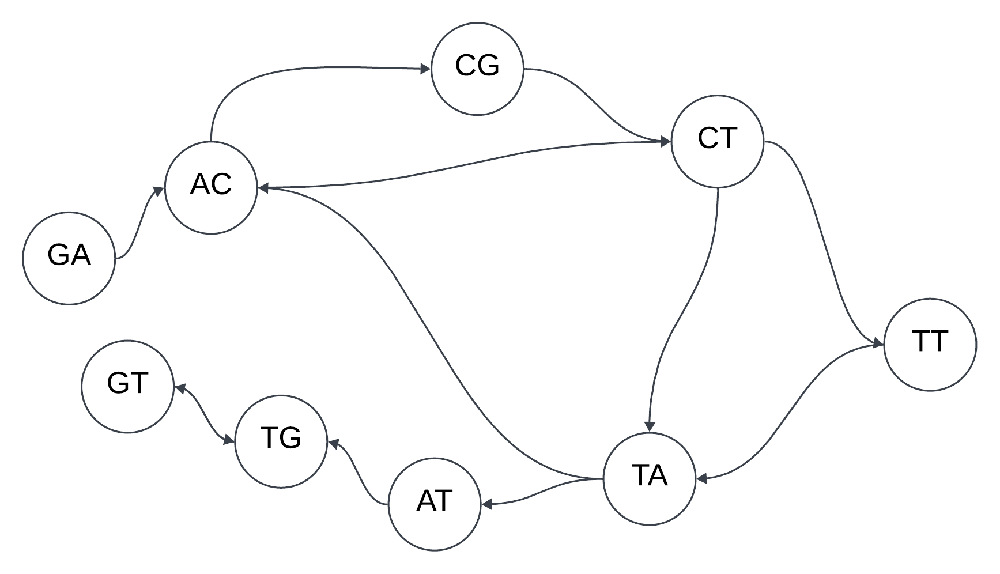
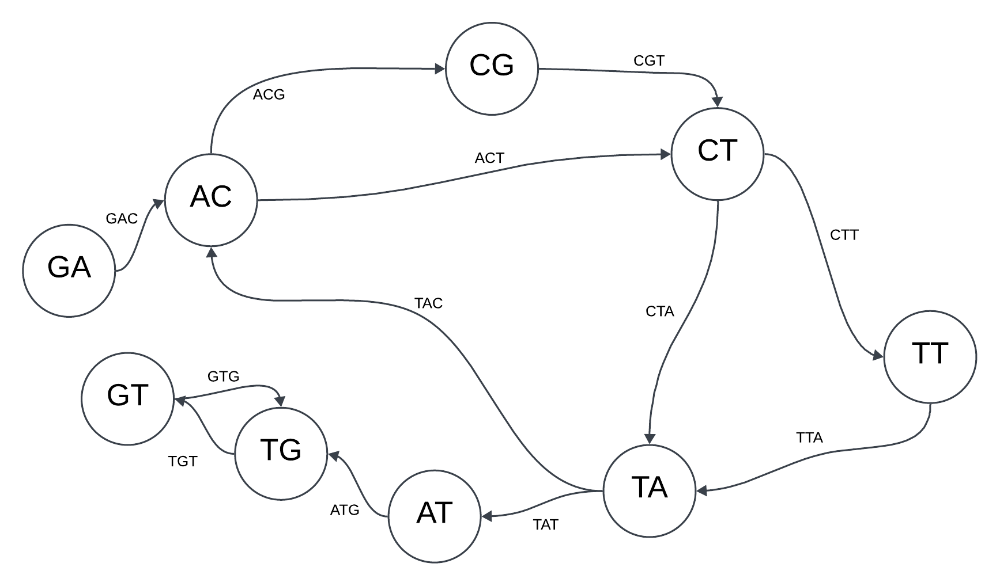

# Ensamblaje de secuencias de ADN mediante grafos de De Bruijn 

## Ejercicio 2: 

Imagina que estás trabajando en un proyecto de investigación genómica y has recibido datos de  secuenciación de ADN fragmentado. La secuenciación te ha proporcionado una lista de lecturas cortas, cada una de longitud 4. Tu tarea es ensamblar estas lecturas cortas para reconstruir la  secuencia original utilizando un grafo de De Bruijn. En este caso partirás de los 3-mers de cada uno de ellos.

- **Datos del ejercicio**:
1. El alfabeto que representa las bases del ADN es {A,C,G,T}. 
2. Se han secuenciado los siguientes fragmentos: 
- GACG
- GCTT
- TTAC
- ACTA
- TATG
- TGTG

- **Objetivo**: 
1. **Construir el grafo de De Bruijn** a partir de las lecturas k-mers (lecturas de longitud 3) para modelar las superposiciones de las lecturas y generar el ensamblaje de la secuencia.

- Descomponer los fragmentos en sufijos y prefijos.
  - GACG -> GAC, ACG
  - GCTT -> GCT, CTT
  - TTAC -> TTA, TAC
  - ACTA -> ACT, CTA
  - TATG -> TAT, ATG
  - TGTG -> TGT, GTG

- División de los 3-mers en prefijos y sufijos de longitud k−1=2
  - GAC: GA -> AC
  - ACG: AC -> CG
  - GCT: GC -> CT
  - CTT: CT -> TT
  - TTA: TT -> TA
  - TAC: TA -> AC
  - ACT: AC -> CT
  - CTA: CT -> TA
  - TAT: TA -> AT
  - ATG: AT -> TG
  - TGT: TG -> GT
  - GTG: GT -> TG
 
  El grafo de De Bruijn es el siguiente:

  
    
<strong>Figura 1.</strong> Grafo resultante del ejercicio 2.
 

2. Determinar la **secuencia original** de ADN que mejor se ensambla a partir de estas lecturas.

En principio, no se puede determinar un camino Euleriano debido a que es imposible encontrar un camino que recorre todas las aristas una sola vez. Esto se puede deber a los siguientes aspectos:
- Fallo a la hora de tomar los fragmentos de ADN. Por tanto, se debería solicitar otra muestra al laboratorio.
- Fallo a la hora de copiar los datos. Si en lugar de existir el nodo GC, este nodo fuese CG, entonces si se podría proporcionar varios caminos Eulerianos que secuenciasen las siguientes cadena:
  - `G-A-C-G-T-T-A-C-T-A-T-G-T-G`
  - `G-A-C-T-A-C-G-T-T-A-T-G-T-G`
  - `G-A-C-G-T-T-A-C-T-A-T-G-T-G`
  - `G-A-C-T-T-A-C-G-T-A-T-G-T-G`

  
    
<strong>Figura 2.</strong> Grafo corregido del ejercicio 2. 
 

  
## Ejercicio 3: 

Estás trabajando en un proyecto de investigación genómica y tienes a tu disposición fragmentos de ADN obtenidos mediante un proceso de secuenciación de próxima generación (NGS). Tu tarea es ensamblar estos fragmentos para reconstruir la secuencia original de ADN utilizando un grafo de De Bruijn. 

- **Datos del ejercicio**:
1. El alfabeto que representa las bases del ADN es {A,C,G,T}. 
2. Las lecturas de ADN obtenidas son fragmentos cortos de longitud k=4. Los fragmentos obtenidos tras la secuenciación son los siguientes:
- AGTC
- GTCA
- TCAG
- CAGT
- AGTT
- GTTG

- **Objetivo**:

1. **Construir el grafo de De Bruijn** a partir de las lecturas k-mers (lecturas de longitud 3) para modelar las superposiciones de las lecturas y generar el ensamblaje de la secuencia.
