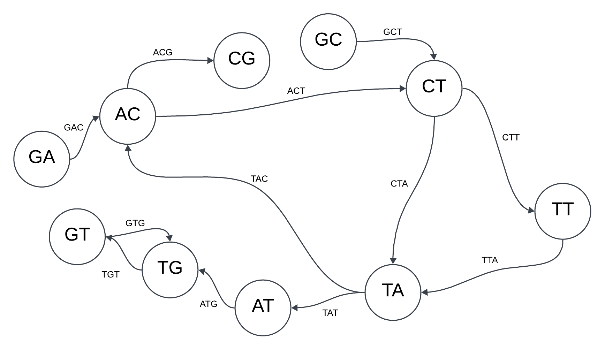
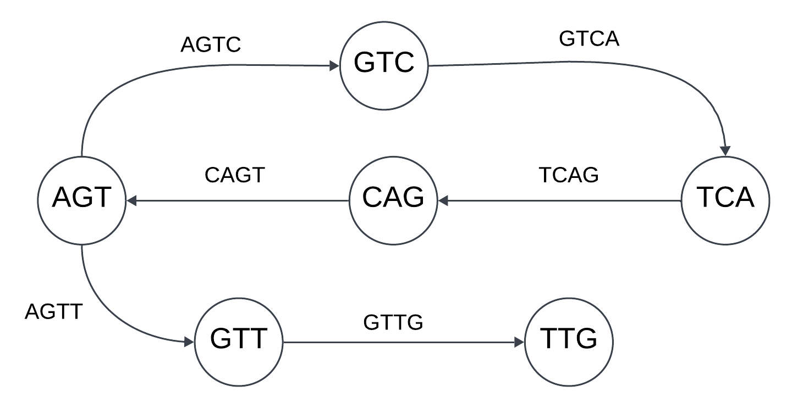

# Ensamblaje de secuencias de ADN mediante grafos de De Bruijn 

## Ejercicio 2: 

Imagina que estás trabajando en un proyecto de investigación genómica y has recibido datos de  secuenciación de ADN fragmentado. La secuenciación te ha proporcionado una lista de lecturas cortas, cada una de longitud 4. Tu tarea es ensamblar estas lecturas cortas para reconstruir la  secuencia original utilizando un grafo de De Bruijn. En este caso partirás de los 3-mers de cada uno de ellos.

#### Datos del ejercicio:
1. El alfabeto que representa las bases del ADN es {A,C,G,T}. 
2. Se han secuenciado los siguientes fragmentos: 
- GACG
- GCTT
- TTAC
- ACTA
- TATG
- TGTG

#### Objetivo: 
1. **Construir el grafo de De Bruijn** a partir de las lecturas k-mers (lecturas de longitud 3) para modelar las superposiciones de las lecturas y generar el ensamblaje de la secuencia.

- Descomponer los fragmentos en sufijos y prefijos.
  - GACG $\rightarrow$ GAC, ACG
  - GCTT $\rightarrow$ GCT, CTT
  - TTAC $\rightarrow$ TTA, TAC
  - ACTA $\rightarrow$ ACT, CTA
  - TATG $\rightarrow$ TAT, ATG
  - TGTG $\rightarrow$ TGT, GTG

- División de los 3-mers en prefijos y sufijos de longitud k−1=2
  - GAC: GA $\rightarrow$ AC
  - ACG: AC $\rightarrow$ CG
  - GCT: GC $\rightarrow$ CT
  - CTT: CT $\rightarrow$ TT
  - TTA: TT $\rightarrow$ TA
  - TAC: TA $\rightarrow$ AC
  - ACT: AC $\rightarrow$ CT
  - CTA: CT $\rightarrow$ TA
  - TAT: TA $\rightarrow$ AT
  - ATG: AT $\rightarrow$ TG
  - TGT: TG $\rightarrow$ GT
  - GTG: GT $\rightarrow$ TG
 
  El grafo de De Bruijn es el siguiente:

  
    
<strong>Figura 1.</strong> Grafo resultante del ejercicio 2.
 

2. Determinar la **secuencia original** de ADN que mejor se ensambla a partir de estas lecturas.

En principio, no es posible determinar un camino Euleriano, ya que no existe un trayecto que permita recorrer todas las aristas una única vez. Esto puede deberse a los siguientes factores:

- **Error en la obtención de los fragmentos de ADN:** Es posible que se haya cometido un error al tomar las muestras, por lo que sería recomendable solicitar al laboratorio una nueva muestra para obtener fragmentos precisos.

- **Error en la copia de datos:** Si el nodo fuera "CG" en lugar de "GC," se podrían identificar varios caminos Eulerianos que secuenciarían correctamente las siguientes cadenas:
  - `G-A-C-G-T-T-A-C-T-A-T-G-T-G`
  - `G-A-C-T-A-C-G-T-T-A-T-G-T-G`
  - `G-A-C-G-T-T-A-C-T-A-T-G-T-G`
  - `G-A-C-T-T-A-C-G-T-A-T-G-T-G`

Sin embargo, al no contar con certeza sobre cuál es el camino correcto, se recomienda obtener una segunda muestra para asegurar la precisión de la secuenciación.

  
    
<strong>Figura 2.</strong> Grafo corregido del ejercicio 2. 
 

  
## Ejercicio 3: 

Estás trabajando en un proyecto de investigación genómica y tienes a tu disposición fragmentos de ADN obtenidos mediante un proceso de secuenciación de próxima generación (NGS). Tu tarea es ensamblar estos fragmentos para reconstruir la secuencia original de ADN utilizando un grafo de De Bruijn. 

#### Datos del ejercicio:
1. El alfabeto que representa las bases del ADN es {A,C,G,T}. 
2. Las lecturas de ADN obtenidas son fragmentos cortos de longitud k=4. Los fragmentos obtenidos tras la secuenciación son los siguientes:
- AGTC
- GTCA
- TCAG
- CAGT
- AGTT
- GTTG

#### Objetivo:

1. **Construir el grafo de De Bruijn** a partir de las lecturas k-mers (lecturas de longitud 3) para modelar las superposiciones de las lecturas y generar el ensamblaje de la secuencia.

-  Crear los k-1-mers mediante la descompocisión de los fragmentos en sufijos y prefijos y construcción del grafo de De Bruijn:
  - AGTC: AGT $\rightarrow$ GTC
  - GTCA: GTC $\rightarrow$ TCA
  - TCAG: TCA $\rightarrow$ CAG
  - CAGT: CAG $\rightarrow$ AGT
  - AGTT: AGT $\rightarrow$ GTT
  - GTTG: GTT $\rightarrow$ TTG

  
    
<strong>Figura 3.</strong> Grafo del ejercicio 3. 
 

2. Determinar la **secuencia original de ADN** ensamblada a partir de las lecturas dadas. Reconstruye la secuencia siguiendo un camino euleriano que recorra todas las aristas del grafo una sola vez.

Para construir el camino Euleriano se debe comenzar por el nodo `AGT`, ya que es aquel que tiene un grado de entrada menor que su grado de salida. Por tanto, la secuencia original de ADN ensamblada es la siguiente: `A-G-T-C-A-G-T-T-G`.

#### Preguntas adicionales:
**1. ¿Qué sucede si algunas de las lecturas contienen errores en sus secuencias? ¿Cómo podrías manejar estos errores en el proceso de ensamblaje?**

Si algunas de las lecturas contienen errores, puede ser más difícil ensamblar la secuencia de ADN correctamente, ya que errores en las lecturas pueden generar nodos o aristas incorrectas en el grafo de De Bruijn. Esto afectaría la capacidad de encontrar un camino euleriano o podría generar ramas o caminos adicionales que complicarían el ensamblaje. En el caso de encontrar errores en las secuencias, se debería repetir la muestra ya que nunca se va a poder secuenciar la cadaena original de ADN.

**2. ¿Qué problemas podrías enfrentar si las secuencias contienen regiones repetitivas?**

Las regiones repetitivas generan nodos y aristas idénticos en múltiples lugares de la secuencia. Esto crea caminos ambiguos en el grafo de De Bruijn, donde varios caminos eulerianos podrían parecer válidos pero llevan a diferentes ensamblajes.

**3. ¿Qué ventajas tendrías al trabajar con k-mers más largos en comparación con k=4?**

Trabajar con k-mers más largos ofrece las siguientes ventajas en el ensamblaje de ADN:
- **Mayor Especificidad y Reducción de Ambigüedades**: Con k-mers más largos, la probabilidad de encontrar k-mers idénticos en diferentes partes del genoma disminuye, ya que secuencias largas tienen menor probabilidad de aparecer repetidamente por casualidad.
- **Reducción de Errores de Secuenciación**: En ensamblajes con k-mers más largos, un solo error de secuenciación afecta menos al ensamblaje global, ya que los k-mers largos suelen repetirse solo si son verdaderamente parte de la secuencia original.
- **Mayor Continuidad en el Ensamblaje**: Los k-mers largos permiten conexiones más amplias entre fragmentos de lectura, reduciendo la fragmentación del ensamblaje en segmentos de secuencia contigua.
- **Reducción en el Tamaño del Grafo de De Bruijn**: Con k-mers cortos, el número de nodos y aristas en el grafo puede aumentar rápidamente, especialmente en secuencias con regiones repetitivas. Al usar k-mers más largos, se reducen los nodos redundantes porque los k-mers más largos suelen ser únicos, disminuyendo el tamaño y la complejidad del grafo.

A pesar de ello, existen limitaciones al usar k-mers muy largos:
- **Mayor sensibilidad a errores**: si ocurre un error en un k-mer largo, se pierde toda la información de ese k-mer, mientras que en k-mers más cortos, el impacto del error es menor.
- **Cobertura**: es necesario tener lecturas de suficiente longitud y cobertura para que los k-mers largos puedan ser representativos.
- **Incremento en el tamaño de memoria**: aunque los k-mers largos reducen la cantidad de nodos redundantes, los valores extremos de k pueden llevar a una explosión en la cantidad de k-mers únicos, aumentando la memoria requerida.

## Ejercicio 4: 

Trabajas en un proyecto de investigación sobre secuencias de ADN complejas. Tienes fragmentos de ADN obtenidos mediante un proceso de secuenciación, pero tu objetivo es identificar regiones que, debido a la repetición de secuencias o errores, hacen imposible ensamblar correctamente el ADN utilizando solo un grafo de De Bruijn. 

#### Datos del ejercicio:
1. El alfabeto que representa las bases del ADN es {A,C,G,T}. 
2. Los fragmentos de ADN obtenidos son fragmentos cortos de longitud $k=4$. Los fragmentos obtenidos tras la secuenciación son los siguientes:
- AGTT
- GTTG
- TTGA
- TGAC
- GACG
- ACGA
- CGAA
- GAAC
- AACG

#### Objetivo:

1. **Construir el grafo de De Bruijn**. Divide cada fragmento en un prefijo de longitud $k−1=3$ y un sufijo de longitud $k−1=3$. Construye un grafo dirigido donde los nodos sean los prefijos y sufijos, y las aristas representen las lecturas que conectan estos prefijos y sufijos.
   
  - AGTT: AGT $\rightarrow$ GTT
  - GTTG: GTT $\rightarrow$ TTG
  - TTGA: TTG $\rightarrow$ TGA
  - TGAC: TGA $\rightarrow$ GAC
  - GACG: GAC $\rightarrow$ ACG
  - ACGA: ACG $\rightarrow$ CGA
  - CGAA: CGA $\rightarrow$ GAA
  - GAAC: GAA $\rightarrow$ AAC
  - AACG: AAC $\rightarrow$ ACG

  
    
<strong>Figura 4.</strong> Grafo del ejercicio 4. 
 

2. **Identificar el problema**: 
- Intenta seguir un camino euleriano en el grafo.
- Describe por qué no es posible ensamblar la secuencia original utilizando solo un grafo de De Bruijn.

En el grafo descrito, sí es posible seguir un camino un camino euleriano que ensambla la secuencia original, la cual sería la siguiente: `AGTTGACGAACG`. 
